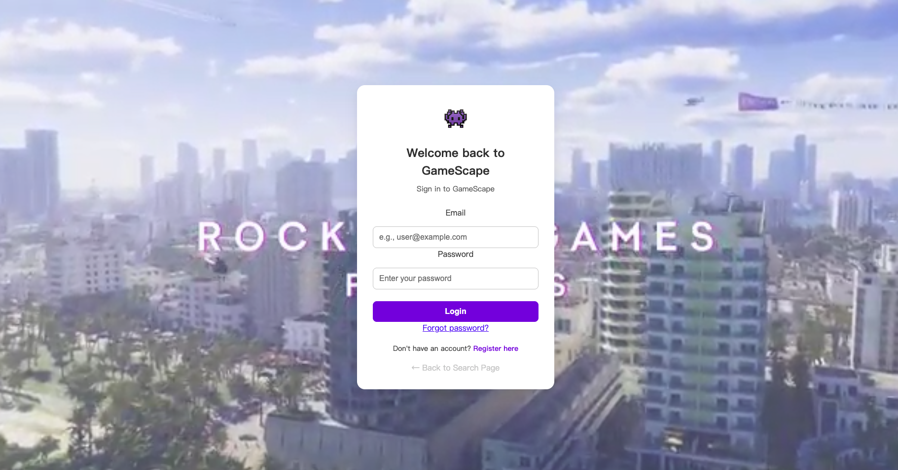
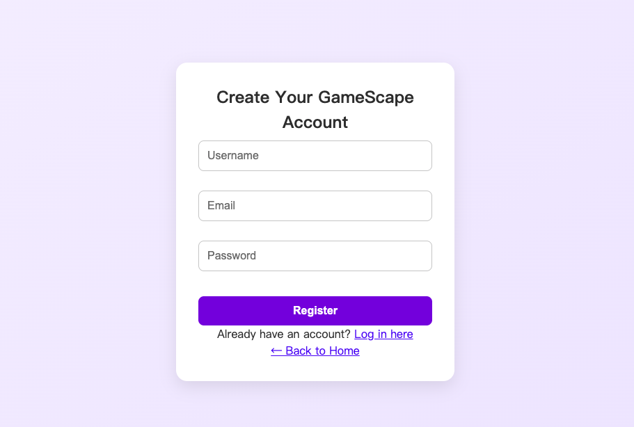
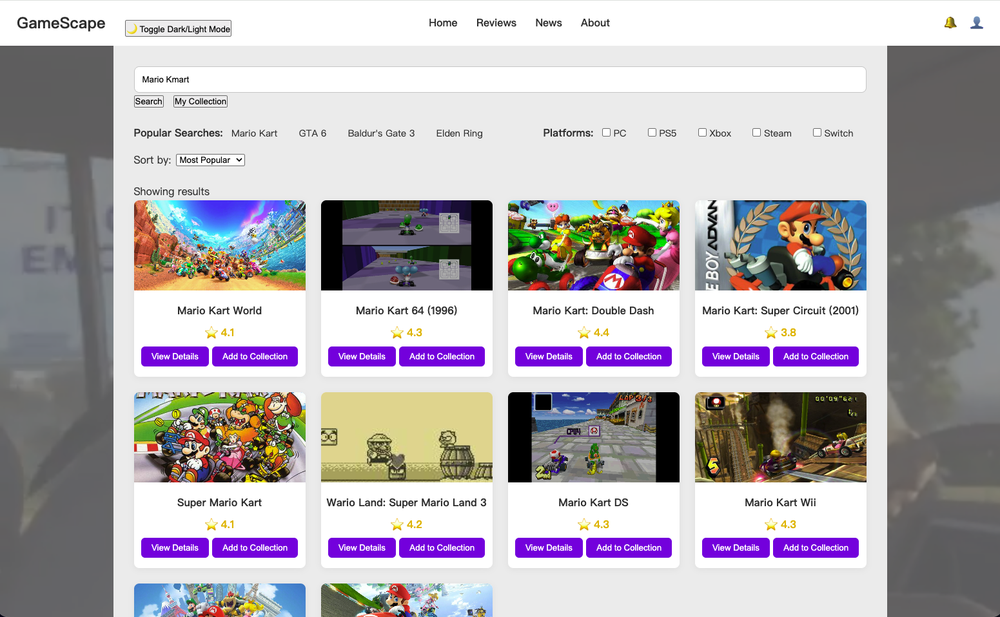
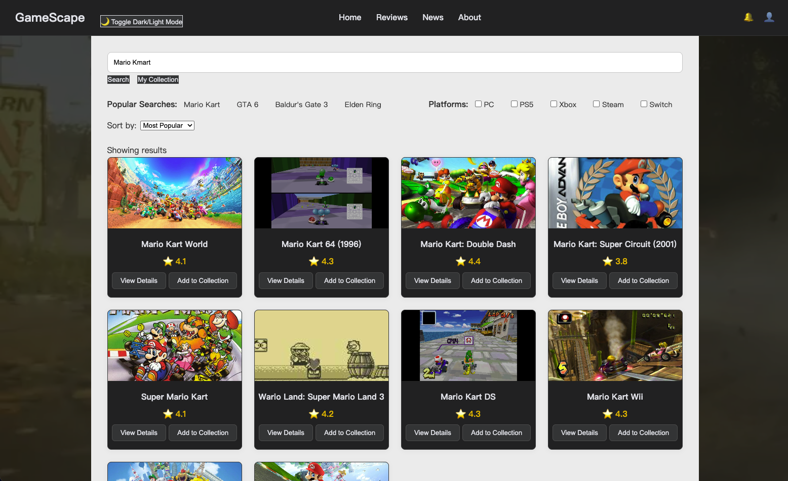
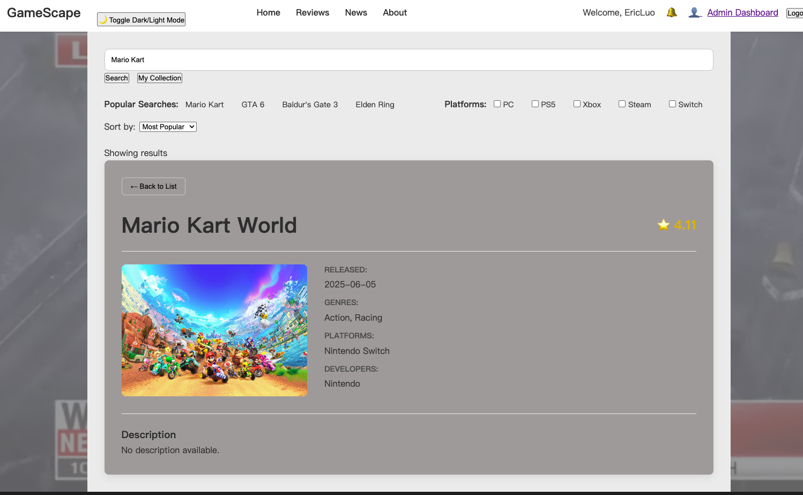
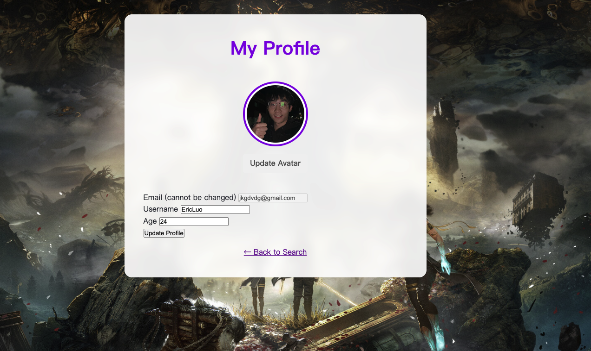
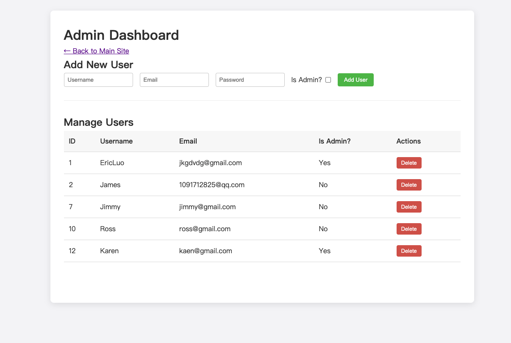

# 🎮 GameScape

### Full-Stack Game Discovery & Personal Collection Web Application

GameScape is a full-stack web application that allows users to **discover video games, explore detailed game information, build a personal game collection, and manage their profile** in one place.

The application integrates with the **RAWG Video Games Database API** and combines a vanilla JavaScript frontend with a **Node.js / Express / SQLite** backend to provide authentication, persistent user data, game collection management, profile customisation, and administrative functionality.

> **University Group Project**  
> Developed as part of a Web & Database Computing project and presented here as a portfolio project.

---

## 🎥 Demo

▶️ **Video Demonstration:**  
https://www.youtube.com/watch?v=sN5_1FOl3zc

---

## ✨ Key Features

### 🔍 Game Discovery

Users can search for video games through the RAWG Video Games Database API and explore information including:

- Game descriptions
- Ratings
- Platforms
- Genres
- Game artwork and related information

### 🔐 Authentication & Sessions

GameScape includes a complete user authentication flow:

- User registration
- User login
- Secure password hashing with `bcryptjs`
- Session-based authentication with `express-session`
- Persistent sessions stored using SQLite

### ❤️ Personal Game Collection

Authenticated users can create and maintain their own game library.

Users can:

- Add games to their collection
- View saved games
- Remove games
- Keep collections associated with their user account
- Export collection data as **JSON**
- Export collection data as **CSV**

### 👤 User Profile

Logged-in users can manage profile information including:

- Username
- Age
- Custom avatar image

### 🛡️ Admin Dashboard

The application includes role-based administrative functionality.

Administrators can:

- View registered users
- Create new users
- Delete user accounts
- Access protected administrative functionality

Dedicated middleware is used to separate authenticated-user and administrator permissions.

### 🌙 Dark / Light Mode

Users can switch between light and dark interface themes for improved usability and personal preference.

---

# 🛠️ Tech Stack

| Area | Technologies |
|---|---|
| **Frontend** | HTML5, CSS3, JavaScript |
| **Backend** | Node.js, Express.js |
| **Database** | SQLite |
| **ORM** | Sequelize |
| **API Communication** | Axios |
| **Authentication** | bcryptjs, express-session |
| **Session Storage** | connect-sqlite3 |
| **File Uploads** | Multer |
| **External API** | RAWG Video Games Database API |

---

# 📸 Screenshots

## 🔐 User Authentication

GameScape provides user registration and login functionality for secure access to personalised features.

### Login



### Registration



---

## 🎮 Game Search & Discovery

Users can search for games, browse search results, view ratings, and access their personal game collection.

### Light Mode



### Dark Mode

GameScape supports both light and dark interface themes.



---

## 🔎 Game Details

Users can open individual games to view detailed information including release date, genres, platforms, developers, and ratings.



---

## 👤 User Profile

Registered users can manage profile information including their username, age, and custom avatar.



---

## 🛡️ Admin Dashboard

Administrators have access to a dedicated dashboard for user management, including creating users, assigning administrator privileges, and deleting accounts.



---

# 🏗️ Application Architecture

GameScape follows a client-server architecture:

```text
Browser
   │
   ▼
HTML / CSS / JavaScript Frontend
   │
   │ HTTP / Axios
   ▼
Node.js + Express Backend
   │
   ├── Authentication
   ├── User Management
   ├── Game Routes
   ├── Collection Management
   ├── Profile Management
   └── Admin Operations
   │
   ▼
Sequelize ORM
   │
   ▼
SQLite Database

Frontend / Backend
        │
        ▼
RAWG Video Games Database API
```

---

# 📁 Project Structure

```text
gamescape-full-stack-web-app/
│
├── backend/
│   │
│   ├── middleware/
│   │   ├── isAdmin.js
│   │   └── isAuthenticated.js
│   │
│   ├── routes/
│   │   ├── admin.js
│   │   ├── auth.js
│   │   ├── collection.js
│   │   ├── games.js
│   │   ├── index.js
│   │   ├── profile.js
│   │   └── users.js
│   │
│   ├── index.js
│   ├── server.js
│   ├── package.json
│   └── package-lock.json
│
├── frontend/
│   │
│   ├── assets/
│   │   ├── css/
│   │   ├── images/
│   │   ├── js/
│   │   └── videos/
│   │
│   ├── index.html
│   ├── login.html
│   ├── register.html
│   ├── Search.html
│   ├── dashboard.html
│   ├── profile.html
│   ├── User Favorite Page.html
│   └── admin-dashboard.html
│
├── screenshots/
│   ├── login.png
│   ├── register.png
│   ├── game-search-light.png
│   ├── game-search-dark.png
│   ├── game-details.png
│   ├── profile.png
│   └── admin-dashboard.png
│
├── .gitignore
└── README.md
```

---

# 🔌 Backend API Structure

The backend is organised into separate route modules to keep different responsibilities isolated.

```text
routes/
├── auth.js          → authentication
├── users.js         → user operations
├── games.js         → game-related requests
├── collection.js    → personal game collection
├── profile.js       → user profile management
├── admin.js         → administrator functionality
└── index.js         → route entry point
```

Protected functionality is controlled through:

```text
middleware/
├── isAuthenticated.js
└── isAdmin.js
```

This provides separation between public functionality, authenticated-user functionality, and administrator functionality.

---

# 💾 Data Persistence

GameScape uses **SQLite with Sequelize ORM** to persist application data.

The application stores information such as:

- User accounts
- Profile information
- Authentication information
- Personal game collections
- Session data

Database and runtime files are intentionally excluded from this public repository.

---

# 🔒 Security & Privacy

The public portfolio repository excludes generated or potentially sensitive local files, including:

```text
node_modules/
.env
*.sqlite
*.sqlite3
*.db
backend/uploads/
```

Passwords are hashed using `bcryptjs` rather than stored as plain text.

Authentication and administrative routes are protected through dedicated middleware.

---

# 🚀 Running the Project Locally

## 1. Clone the repository

```bash
git clone https://github.com/Jie-0511/gamescape-full-stack-web-app.git
cd gamescape-full-stack-web-app
```

## 2. Install backend dependencies

```bash
cd backend
npm install
```

## 3. Start the backend

```bash
npm start
```

The backend runs locally on:

```text
http://localhost:8080
```

## 4. Start the frontend

The frontend is built using HTML, CSS, and vanilla JavaScript.

A simple local development server such as **VS Code Live Server** can be used.

Open the `frontend` directory and launch the required HTML page using Live Server.

The frontend communicates with the backend API running on port `8080`.

---

# ⚠️ Current Limitations

The current version of the project has several known limitations:

- Platform filtering controls are currently UI placeholders
- Search sorting is not fully implemented
- Personal game review / journaling functionality is not yet implemented
- The forgot-password interface is currently a placeholder
- Some user feedback still uses browser alerts or console messages

These represent potential areas for future development rather than hidden functionality.

---

# 🔮 Future Improvements

Possible future improvements include:

- Functional platform filtering
- Search sorting
- Personal game reviews and ratings
- Game journaling functionality
- Password recovery
- Improved in-app notification system
- Automated backend/API testing
- Accessibility improvements
- Production deployment configuration

---

# 👩‍💻 Project Context & Contribution

GameScape was developed as a **university group project** focused on applying full-stack web development and database concepts in a practical application.

The project demonstrates experience with:

- Client-server web architecture
- REST-style backend routes
- External API integration
- User authentication
- Session management
- Relational data persistence
- CRUD operations
- Role-based access control
- File uploads
- Frontend-backend integration
- Git-based team development

### My Contribution

I worked primarily as a **Backend Developer** on GameScape, with a focus on connecting the application to external game data and supporting the backend functionality behind game discovery and personal collections.

My main contributions included:

* **RAWG API Integration** – Integrated the RAWG Video Games Database API to support game search and retrieval of detailed game information.
* **Game Search & Details Backend** – Contributed to the server-side functionality and API endpoints used by the frontend to search for games and retrieve game details.
* **Personal Game Collection APIs** – Developed backend functionality for managing user game collections, including adding games, retrieving a user's saved games, and removing games from the collection.
* **Frontend–Backend Integration Support** – Worked on connecting game-related frontend interactions with backend/API functionality so that external game data and user collection features could operate together.
* **Testing & Integration** – Supported integration and debugging of the game-related functionality as the frontend, backend, external API, and database components were brought together.
* **Project Documentation** – Contributed to project documentation and the schema diagram as part of the team's milestone deliverables.

This project was developed collaboratively by a four-member team. My primary responsibility was the **backend and API integration for game discovery and collection management**, while other team members led areas such as frontend UI development, database schema/authentication, and project coordination/QA.

---

# 📚 What I Learned

Through this project, I gained practical experience in connecting multiple parts of a full-stack application rather than developing frontend and backend components in isolation.

Key learning areas included:

- Connecting frontend interfaces to backend APIs
- Working with third-party REST APIs
- Designing persistent user-specific functionality
- Managing authentication and sessions
- Working with relational databases through an ORM
- Structuring backend routes and middleware
- Debugging communication between frontend, backend, and external APIs
- Collaborating on a shared software project using Git

---

# 🙏 Acknowledgements

Game data is provided by the **RAWG Video Games Database API**.

This repository is a portfolio presentation of an academic group project.
